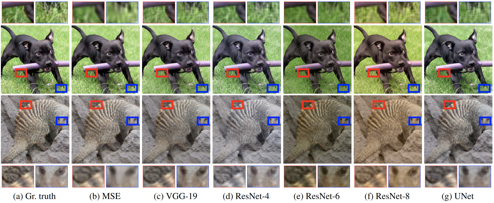
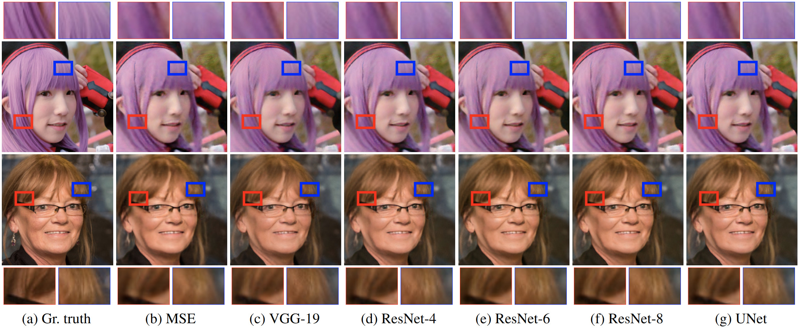
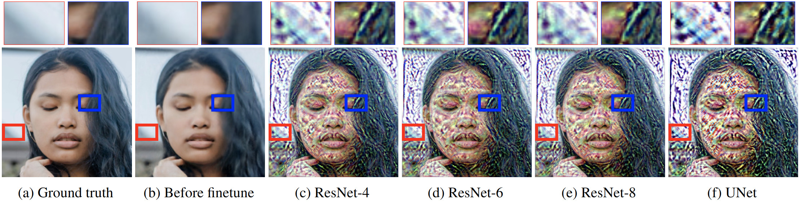

# Perceptual Gradient Networks

Predicting gradient (of perceptual loss) without doing a backward pass.


## Environment

We support running our code via Docker. You can either pull a pre-built image:

```bash
docker pull dniku/perceptual_gradient_networks
```

or build it yourself:

```bash
cat Dockerfile | docker build -t perceptual_gradient_networks .
```

After that, all commands can be run with the following prefix:

```bash
docker run \
--ipc=host \
--rm -it \
-u $(id -u):$(id -g) \
-v /etc/localtime:/etc/localtime:ro \
-v $(pwd):/workspace:rw \
-v ~/.cache/torch:/home/docker/.cache/torch \
-v <path to directory with "ImageNet" and "ffhq-dataset" subdirectories>:/datasets:ro \
-v <path for downloaded checkpoints>:/checkpoints \
-v <path for output, e.g. /tmp/out>:/out \
perceptual_gradient_networks \
<some command>
```

We'll be referring to this prefix as `$DOCKER_RUN` for brevity.

Note that we use ImageNet for training and FFHQ for validation. We expect that ImageNet be stored in a format compatible with `torchvision.datasets.ImageNet`. It can be downloaded from the [official page](http://www.image-net.org/download-images). FFHQ can be downloaded using the [original repository](https://github.com/NVlabs/ffhq-dataset).


## Pretrained models

All checkpoints can be downloaded from [this Google Drive](https://drive.google.com/drive/folders/1VDWYoqY3qqrueeMxk46Ie1fhPae8uwtA?usp=sharing) folder. The following table provides direct links to checkpoints for each of the models listed in the paper, as well as some parameters that vary across models that we refer to in the following sections.

| parameter              | ResNet-4 | ResNet-6 | ResNet-8 | UNet      |
|------------------------|----------|----------|----------|-----------|
| `EPOCHS`               | 330      | 400      | 1000     | 2140      |
| `WORKER_BATCH_SIZE`    | 48       | 48       | 44¹      | 48        |
| `PGN_ARCH`             | `resnet` | `resnet` | `resnet` | `unet`    |
| `RESNET_NUM_BLOCKS`    | 4        | 6        | 8        | (ignored) |
| `PGN_PROXY_GRAD_SCALE` | 0.025    | 0.025    | 0.025    | 0.048²    |
| URL | [link](https://drive.google.com/file/d/1rQfI4yPi6yAGL90g2n3BVLyy4RIz4S4n/view?usp=sharing) | [link](https://drive.google.com/file/d/1Xua7rdBhMwus4dX0a0OPjh7M-3xtwIoB/view?usp=sharing) | [link](https://drive.google.com/file/d/16qw4VcK33l7ZSqVh2EQsMdZaeDKgo5JP/view?usp=sharing) | [link](https://drive.google.com/file/d/1ywBOqEo3DO7-TyA4pYC2N-Y6TDi7QKev/view?usp=sharing) |

¹ We reduced batch size to fit into GPU memory.<br>
² Different grad scale for UNet is mostly due to legacy reasons. However, according to our experiments, performance is not sensitive to changes in this parameter, and it can easily vary within an order of magnitude.

A StyleGAN checkpoint that we use for validation can be downloaded [here](https://drive.google.com/file/d/1GWoy55FMX1Rp23C_8dbu1N3mmh-h0IP1/view?usp=sharing).


## Validation

### Deep Image Prior



The following command loads images from the ImageNet validation set and trains three [Deep Image Prior](https://arxiv.org/abs/1711.10925) models from identical initialization to reconstruct these images. One model is trained using our synthetic gradients, while the other two are trained with real perceptual and MSE gradients.

```bash
$DOCKER_RUN \
python3 train_pgn.py \
--valid-only \
--workers 1 \
--batches-per-valid-epoch 100 \
--valid-num-iter 3000 \
--dip-input-noise-prob 0 \
--valid-divergence-threshold inf \
--run-dir=/out \
--pgn-arch=$PGN_ARCH \
--resnet-num-blocks=$RESNET_NUM_BLOCKS \
--pgn-proxy-grad-scale=$PGN_PROXY_GRAD_SCALE \
--pgn-checkpoint=/checkpoints/<path to checkpoint of PGN weights>
```

The results in the paper were obtained on 4 GPUs, on a total of `batches_per_valid_epoch=100 x gpus=4 = 400` images. We fix all random seeds, so re-running the code will produce an identical sample from ImageNet validation set.

To reproduce the results of the stability experiments from the paper, simply use `--valid-num-iter=10000` and `--valid-divergence-threshold=2`. Optionally you can also provide `--valid-disable-video` to disable saving the videos of optimization trajectories, which take up a lot of disk space.

### Image2StyleGAN



As described in the paper, to speed up the experiments, we first fit StyleGAN latents to images from the FFHQ validation set using only MSE loss for `T=5000` iterations. This assumes that you have already downloaded the [StyleGAN checkpoint](https://drive.google.com/file/d/1GWoy55FMX1Rp23C_8dbu1N3mmh-h0IP1/view?usp=sharing).

```bash
$DOCKER_RUN \
python3 -m image2stylegan.preinfer_latents \
--run-dir=/out
```

Then, similarly to the Deep Image Prior command, we fine-tune these latents using synthetic gradients, as well as perceptual and real ones:

```bash
$DOCKER_RUN \
python3 train_pgn.py \
--valid-only \
--valid-task stylegan \
--dataset-name stylegan_pretuned \
--workers 1 \
--no-distributed \
--valid-num-iter 1000 \
--valid-batch-size 10 \
--valid-pgn-mse-coef 20 \
--valid-first-samples 100 \
--valid-divergence-threshold inf \
--valid-prc-mse-coef 1 \
--run-dir=/out \
--pgn-arch=$PGN_ARCH \
--resnet-num-blocks=$RESNET_NUM_BLOCKS \
--pgn-proxy-grad-scale=$PGN_PROXY_GRAD_SCALE \
--pgn-checkpoint=/checkpoints/<path to checkpoint of PGN weights>
```

## Training



We performed our experiments on a server with 8 Nvidia P40 GPUs, each with 24 Gb of memory. If your environment does not have such GPUs, reduce the `--worker-batch-size` parameter in the following commands.

The general form of a command to start training is as follows:

```bash
$DOCKER_RUN \
python3 train_pgn.py \
--epochs=$EPOCHS \
--worker-batch-size=$WORKER_BATCH_SIZE \
--pgn-arch=$PGN_ARCH \
--resnet-num-blocks=$RESNET_NUM_BLOCKS \
--pgn-proxy-grad-scale=$PGN_PROXY_GRAD_SCALE \
--pgn-loss-proxy-prc-gt \
--pgn-loss-proxy-l1-gt \
--run-dir=/out
```

To load a checkpoint instead of starting from scratch, you need to add the following CLI arguments to the launch command. All of them are optional. If some are not provided, the corresponding models will be initialized randomly.

```
--pgn-checkpoint=<path to checkpoint of PGN weights>
--pgn-checkpoint-opt=<path to checkpoint of PGN optimizer>
--ae-checkpoints <path to checkpoint of autoencoder #1 weights> <path to a.e. #2> <path to a.e. #3>
--ae-checkpoints-opt <path to checkpoint of autoencoder #1 optimizer> <path to opt. #2> <path to opt. #3>
```

If you are resuming training from a previous training run, there is a shorthand:

```
--resume-dir=<path to --run-dir of the run you want to resume from>/models
--resume-epoch=<number of epoch you want to resume from>
```

## Citing

```
@unpublished{nikulin2020pgn,
	title={Perceptual Gradient Networks},
	author={Dmitry Nikulin and Roman Suvorov and Aleksei Ivakhnenko and Victor Lempitsky},
	year={2020},
}
```
